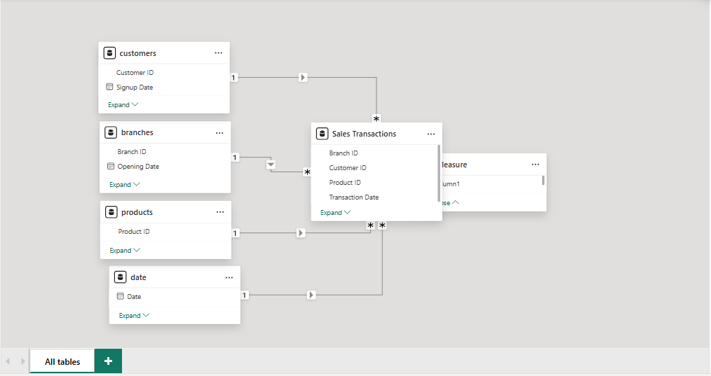
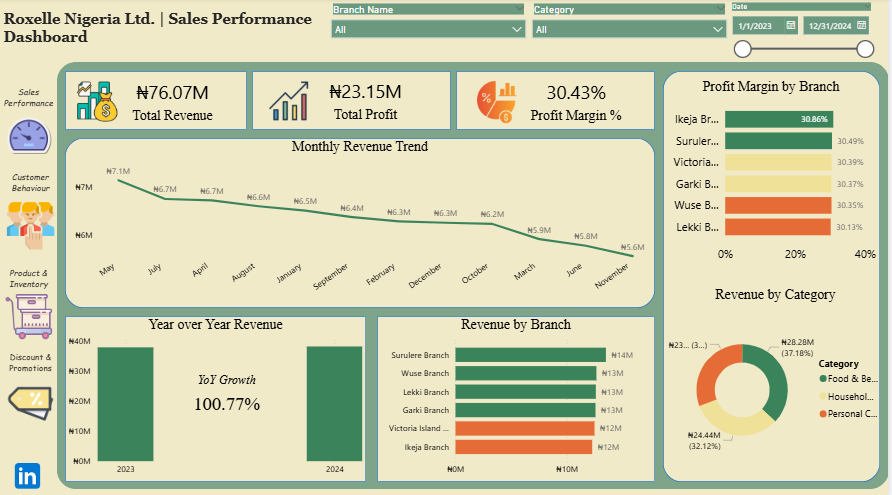
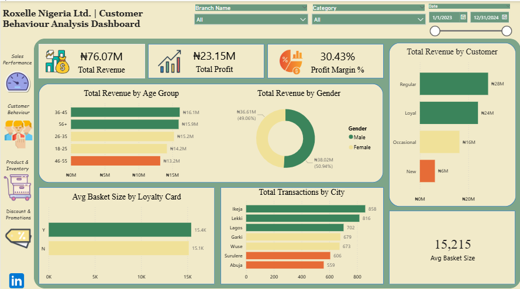
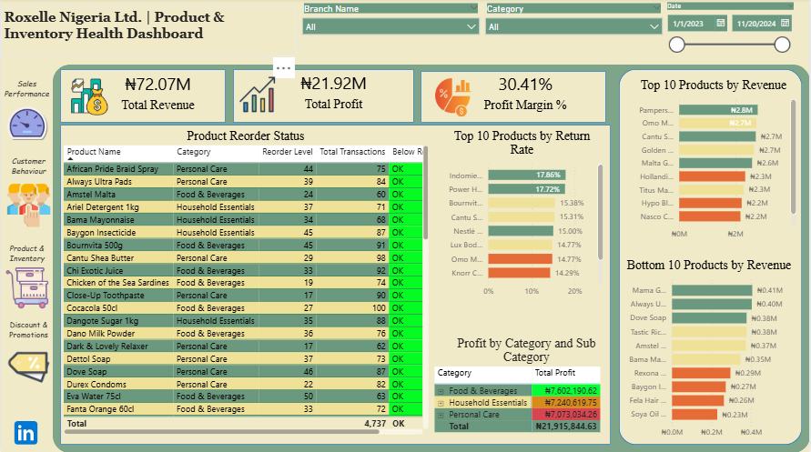
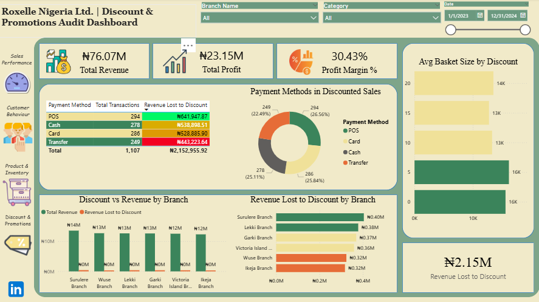

# 🏪 Roxelle Nigeria Ltd. — Sales & Operations Analytics

---

## 📌 1. Project Overview

This project was completed as a Final Year Capstone Assignment for Roxelle Nigeria Ltd., a mid-size Fast-Moving Consumer Goods (FMCG) retail chain operating six branches across Lagos and Abuja. The company sells products across three core categories; Food & Beverages, Personal Care, and Household Essentials.

The goal of this project was to design and build a professional, interactive Power BI dashboard that gives Roxelle's management team full visibility into their sales performance, customer behaviour, product health, and discount spending, replacing their previous reliance on gut instinct and manually updated spreadsheets.

---

## ❓ 2. Business Problem Statement

Roxelle Nigeria Ltd. had no structured reporting system despite collecting 18 months of transactional data across all six branches. Management was making decisions based on manually updated spreadsheets produced at the end of every month. Four key problems were identified:

- **Sales Performance** — No clear view of which branches were truly profitable versus those that only appeared to perform well due to heavy discounting
- **Customer Behaviour** — Over 1,200 customer records had never been analysed to understand spending patterns or loyalty card effectiveness
- **Product Performance** — No visibility into which of the 60 products across 3 categories were driving profit and which were dead weight
- **Discount & Promotions** — Discounts were being applied inconsistently across branches with no data-driven evidence that they were generating enough volume to justify the margin sacrifice

---

## 📂 3. Dataset Description

Five CSV datasets were provided and loaded into Power BI via Power Query. All datasets are available in the `/datasets` folder of this repository.

| File | Rows | Description |
|---|---|---|
| `sales_transactions.csv` | 5,000 | Core fact table containing all sales transactions including quantity, price, discount, and return status |
| `customers.csv` | 1,200 | Customer profiles including age, gender, city, loyalty card status and customer segment |
| `products.csv` | 60 | Product catalogue containing category, sub-category, cost price, unit price and reorder level |
| `branches.csv` | 6 | Branch information including location, manager name, opening date and store size |
| `date.csv` | 731 | Date dimension table covering the full 2023 to 2024 trading period |

### Data Quality Actions Taken

| Issue | Action Taken |
|---|---|
| 107 blank Customer IDs in sales_transactions | Replaced with "Unknown" to preserve transaction integrity |
| No duplicate rows found in any table | Removed Duplicates step applied to all 5 tables as best practice |
| All column names contained underscores | Renamed to professional readable format across all tables |
| Data types not set | Correct data types assigned to every column in all 5 tables |

---

## 🗂️ 4. Data Model

A Star Schema was built with `sales_transactions` as the central fact table and four surrounding dimension tables. All relationships were configured manually to ensure accuracy.

### Relationship Configuration

| Dimension Table | Key Column | Fact Table | Key Column | Cardinality | Filter Direction |
|---|---|---|---|---|---|
| customers | Customer ID | sales_transactions | Customer ID | One to Many | Single |
| products | Product ID | sales_transactions | Product ID | One to Many | Single |
| branches | Branch ID | sales_transactions | Branch ID | One to Many | Single |
| date | Date | sales_transactions | Transaction Date | One to Many | Single |

### Design Decisions

- **Single filter direction** was applied to all relationships to prevent ambiguous filter paths and ensure correct aggregations across all visuals
- **Assume Referential Integrity** was left unticked on all relationships because 107 transactions contained "Unknown" Customer IDs that do not exist in the customers table
- **No Many-to-Many relationships** exist in this model
- A dedicated **Measures table** was created to store all DAX measures separately from the data tables

### Star Schema Screenshot

---

## 📊 5. DAX Measures Documentation

All measures are stored in a dedicated **Measures** table. Below is the full documentation of every measure created.

| Measure Name | DAX Formula | Purpose |
|---|---|---|
| Total Revenue | `SUM(sales_transactions[Revenue After Discount])` | Sum of all revenue after discounts applied |
| Total Cost | `SUMX(sales_transactions, sales_transactions[Quantity] * RELATED(products[Cost Price]))` | Total cost calculated row by row using product cost price |
| Total Profit | `[Total Revenue] - [Total Cost]` | Net profit across all transactions |
| Profit Margin % | `DIVIDE([Total Profit], [Total Revenue], 0)` | Overall profit margin as a percentage |
| Total Transactions | `DISTINCTCOUNT(sales_transactions[Transaction ID])` | Count of unique transactions |
| Return Rate % | `DIVIDE(COUNTROWS(FILTER(sales_transactions, sales_transactions[Is Returned] = 1)), [Total Transactions], 0)` | Percentage of transactions that resulted in a return |
| Avg Basket Size | `DIVIDE([Total Revenue], [Total Transactions], 0)` | Average revenue per transaction |
| MoM Revenue % | `DIVIDE([Total Revenue] - CALCULATE([Total Revenue], DATEADD('date'[Date], -1, MONTH)), CALCULATE([Total Revenue], DATEADD('date'[Date], -1, MONTH)), 0)` | Month over month revenue change as a percentage |
| YoY Revenue % | `DIVIDE([Total Revenue] - CALCULATE([Total Revenue], SAMEPERIODLASTYEAR('date'[Date])), CALCULATE([Total Revenue], SAMEPERIODLASTYEAR('date'[Date])), 0)` | Year over year revenue growth as a percentage |
| Revenue Lost to Discount | `SUMX(sales_transactions, sales_transactions[Quantity] * sales_transactions[Unit Price] * (sales_transactions[Discount %] / 100))` | Total revenue sacrificed through discounting |

### Calculated Columns

| Column | Table | Formula | Purpose |
|---|---|---|---|
| Revenue After Discount | sales_transactions | Created in Power Query | Quantity x Unit Price x (1 - Discount% / 100) |
| Profit Per Transaction | sales_transactions | `(sales_transactions[Unit Price] * sales_transactions[Quantity]) - (RELATED(products[Cost Price]) * sales_transactions[Quantity])` | Profit generated per individual transaction |
| Age Group | customers | `IF(customers[Age] >= 56, "56+", IF(customers[Age] >= 46, "46-55", IF(customers[Age] >= 36, "36-45", IF(customers[Age] >= 26, "26-35", "18-25"))))` | Buckets customer ages into 5 groups for analysis |

---

## 💡 6. Key Insights & Findings

### Sales Performance
- Total revenue of **₦76.07M** was generated across 5,000 transactions over the 2023 to 2024 period
- Overall profit margin stands at **30.43%** which is healthy for an FMCG retail operation
- **Surulere Branch** generated the highest total revenue across all six branches
- **Ikeja Branch** recorded the highest profit margin, demonstrating superior cost efficiency
- Year-over-year revenue grew by **100.77%** from 2023 to 2024
- Revenue peaks in the middle of the year with a notable dip towards the end of the year

### Customer Behaviour
- **Regular customers** generate the most revenue across all four customer segments
- Loyalty cardholders spend **more per transaction** than non-holders, confirming the programme delivers value
- **Male customers** are the dominant revenue-generating gender
- The **36-45 age group** is Roxelle's most valuable demographic by revenue contribution
- **Lagos** is the most active city by number of transactions

### Product & Inventory Health
- The overall product return rate is **10.68%** — above acceptable FMCG retail thresholds
- **Indomie Noodles** recorded the highest individual product return rate across all 60 SKUs
- Clear top and bottom performers exist within the product portfolio across all three categories
- Certain products are consistently approaching their reorder levels creating potential stockout risk

### Discount & Promotions Audit
- **₦2.15M** in revenue was lost to discounts across the full trading period
- Discounts are applied inconsistently across branches with no clear correlation between heavy discounting and proportionally higher sales volume
- **POS payments** are the most common channel associated with discounted transactions
- No strong evidence exists that higher discount levels consistently produce larger basket sizes

---

## ✅ 7. Recommendations

### 1. Address Product Return Rates Urgently
The overall return rate of 10.68% is unacceptably high for FMCG retail. Indomie Noodles specifically requires immediate investigation into supplier quality, storage conditions, and handling procedures across branches.

### 2. Expand the Loyalty Programme
Loyalty cardholders demonstrably spend more per transaction than non-holders. Roxelle should prioritise expanding loyalty card enrolment, introduce tiered rewards, and run targeted campaigns to convert Regular customers into Loyal customers.

### 3. Introduce Branch-Level Discount Controls
₦2.15M was lost to discounts with no consistent evidence of proportional revenue gains. POS discount approvals should require manager authorisation above a set threshold. Each branch should be given a monthly discount budget to prevent uncontrolled margin sacrifice.

### 4. Replicate Ikeja Branch's Cost Model
While Surulere leads in revenue, Ikeja leads in profit margin. Ikeja's operational approach should be studied and replicated across underperforming branches to improve overall profitability.

### 5. Target the 36-45 Male Demographic
This is Roxelle's highest value customer group. Marketing campaigns, promotions, and product stocking decisions should reflect this insight. Strategies to attract female customers and younger demographics should also be explored to diversify the customer base.

### 6. Monitor Reorder Levels Proactively
Products approaching reorder levels represent a stockout risk that directly impacts revenue. A weekly reorder report should be generated from the dashboard to ensure timely restocking across all branches.

---

## 📸 8. Dashboard Screenshots

### Page 1 — Sales Performance

### Page 2 — Customer Behaviour Analysis

### Page 3 — Product & Inventory Health

### Page 4 — Discount & Promotions Audit

### Data Model — Star Schema

---

## 🛠️ 9. Tools Used

| Tool | Purpose |
|---|---|
| Microsoft Power BI Desktop | Data cleaning, modelling, DAX measures, and dashboard building |
| Power Query Editor | Data loading, transformation, and cleaning of all 5 CSV datasets |
| DAX (Data Analysis Expressions) | Writing all calculated measures and columns |
| Microsoft Power BI Service | Publishing and sharing the completed dashboard online |
| GitHub | Version control and project portfolio documentation |
| Microsoft Word | 2-page written summary report |

---

## 🔗 10. Published Report & Submission Checklist

### Published Power BI Report
🔗 [Click here to view the live dashboard](https://app.powerbi.com/groups/me/reports/6c01a029-3f7c-49d8-a846-441ca68573fd/6d858c2e0e5c62e4de07?experience=power-bi&clientSideAuth=0)

### Submission Checklist

| Item | Status |
|---|---|
| Power BI .pbix file uploaded to GitHub | ✅ Complete |
| All 5 CSV datasets in /datasets folder | ✅ Complete |
| Published Power BI Service link | ✅ Complete |
| Scheduled Refresh screenshot in README | ✅ Complete |
| GitHub README contains all 10 sections | ✅ Complete |
| DAX measures fully documented in README | ✅ Complete |
| Data model screenshot visible in README | ✅ Complete |
| Minimum 4 dashboard screenshots included | ✅ Complete |
| 2-page written summary PDF in repository | ✅ Complete |
| Repository set to Public | ✅ Complete |

---

## 👤 Author

| Detail | Info |
|---|---|
| **Name** | Mayowa Ishola |
| **Project Type** | Final Year Capstone Assignment |
| **Tool** | Microsoft Power BI |
| **Issued By** | Temperance Godwin, Head of Business Intelligence |
| **Date** | May 2026 |

---

*This project was completed as part of a Power BI Final Year Capstone Assignment.
All data used is synthetic and generated for educational purposes only.*
